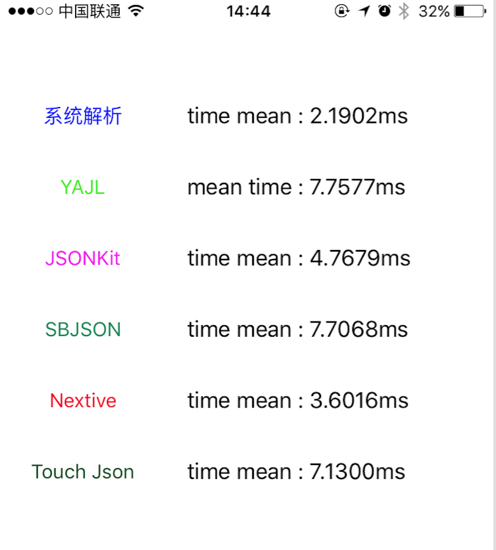

## iOS JSON 解析框架的调研情况：

### iOS 主流的JSON解析框架有以下几个：
####1、NSJSONSerialization（系统提供）
####2、JSONKit:[https://github.com/johnezang/JSONKit](https://github.com/johnezang/JSONKit)
####3、TouchJSON:[https://github.com/TouchCode/TouchJSON](https://github.com/TouchCode/TouchJSON)
####4、SBJSON:[https://github.com/groopd/SBJSON-library](https://github.com/groopd/SBJSON-library)
####5、Nextive Json:[https://github.com/nextive/NextiveJson](https://github.com/nextive/NextiveJson)
####6、YAJL：[https://github.com/gabriel/yajl-objc](https://github.com/gabriel/yajl-objc) 

###1、易用性

#### 工程引用：除了系统提供的NSJSONSerialization，使用其他的第三方库都需要导入相关头文件进行解析即可，另外，JSONKIT、SBJSON不支持ARC，需做支持ARC处理，所有不支持ARC的文件，在使用时可以对其加上 -fno-objc-arc 的编译标志即可;使用的时候，所有的这些第三方库和系统提供的NSJSONSerialization用法几乎一致，只需一两行代码就可搞定，使用方便。

#### 更新频率：截止至2016.0810日，以github上该库的最近Commits情况为准（见下表1.1）
|JSON 框架|最近提交|   
|---|---|---|---|---|---|---|
|[JSONKit](https://github.com/johnezang/JSONKit)|13 Jul 2012||
|[TouchJSON](https://github.com/TouchCode/TouchJSON)|19 Sep 2015||
|[SBJSON](https://github.com/groopd/SBJSON-library)|4 Dec 2010||
|[Nextive Json](https://github.com/nextive/NextiveJson)|18 Jan 2013||
|[YAJL](https://github.com/gabriel/yajl-objc)|17 Mar 2016|
注: NSJSONSerialization不支持iOS 5 以下的系统。

###2、 性能

#### 以解析[demo]()中的JSON文件为例得出这如下的实验结果(见下图2.1)：
补充：右边的数据为对应的JSON解析框架解析的时间,左边按钮点击的越多，右边的数据将会越准确，取的是每次点击过程中解析JSON数据的平均值。   
  

#### 显然，性能方面系统提供的NSJSONSerialization无疑是性能最好的，其次为Nextive、JSONKit、Touch JSON 、YAJL 和SBJSON。（YAJL和SBJSON不相上下，量化为同一等级）

### 3、使用人数

#### 除NSJSONSerialization 之外，其他的JSON解析库以Github上的Star为标准来衡量使用人数的多少（见下表3.1）。

|JSON 框架|Star Number|   
|---|---|---|---|---|---|---|
|[JSONKit](https://github.com/johnezang/JSONKit)|5880|
|[TouchJSON](https://github.com/TouchCode/TouchJSON)|820|
|[SBJSON](https://github.com/groopd/SBJSON-library)|60|
|[Nextive Json](https://github.com/nextive/NextiveJson)|310|
|[YAJL](https://github.com/gabriel/yajl-objc)|670|

在NSJSONSerialization的使用人数上，结合自身项目的情况以及各种性能和使用的方便性设置NSJSONSerialization的级别和JSONKit一样，（目测估计会高出JSONKit很多）。
### 4、总结：
####1、NSJSONSerialization 是iOS 里最好的JSON解析方式：在使用这些第三方JSON解析库的时候，这些库或多或少都会对系统相关类方法进行了延展，这样造成的后果就是或多或少增加以下额外的开销。经过对如上三个指标的衡量，最后得出系统提供的NSJSONSerialization各项指标均优胜于其他任何的第三方库，如果项目中之前仍然使用其他第三方JSON解析库的话，最好改成使用系统提供的。
#### 2、使用其他第三方库的项目将逐步转向使用NSJSONSerialization：NSJSONSerialization是iOS 5 之后才出来的，老的一些项目可能会使用JSONKit 之类的第三方JSON解析库进行解析；由表1.1可以看出，各个JSON解析第三方库现在基本上都已不更新，慎用。

##由此得出最后综合情况如下：
注：以下的结果不是非常之严谨

|JSON 框架|性能|易用性|使用人数|综合评价|   
|---|---|---|---|---|---|---|
|[NSJSONSerialization]()|✭✭✭✭✭|✭✭✭✭✭|✭✭✭✭✭|✭✭✭✭✭|
|[JSONKit](https://github.com/johnezang/JSONKit)|✭✭✭|✭✭✭✭|✭✭✭✭|✭✭✭✭✭|
|[TouchJSON](https://github.com/TouchCode/TouchJSON)|✭✭|✭✭✭✭|✭✭✭|✭✭✭⭐︎|
|[SBJSON](https://github.com/groopd/SBJSON-library)|✭|✭✭✭✭|✭|✭✭|
|[Nextive Json](https://github.com/nextive/NextiveJson)|✭✭✭✭|✭✭✭✭|✭✭|✭✭✭⭐︎|
|[YAJL](https://github.com/gabriel/yajl-objc)|✭|✭✭✭✭|✭✭✭|✭✭⭐︎|

若不得不选用第三方JSON解析，推荐使用JSONKit,对于Touch JSON 和Nextive Json分数相同的情况，若非要选择其中之一，从性能上考虑当选择Nextive Json,考虑到后期的方便维护以及问题解决的方便，最好选择Touch JSON。不过恰好次三种都不是最好的选则。

##最佳选择：NSJSONSerialization

